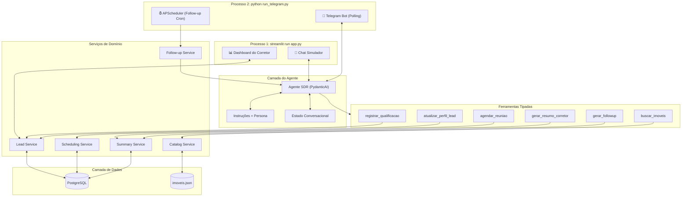

# Plano de Implementação: Agente SDR Imobiliário com IA
**Hackathon FIAP — Tech Challenge (Fase 5)**

---

## 1. O que é um SDR (Sales Development Representative)?

**SDR** significa **Sales Development Representative** (em português: **Representante de Desenvolvimento de Vendas** ou **Pré-vendedor**).

No contexto comercial e imobiliário, o SDR é o profissional ou agente responsável pela **primeira etapa do funil de vendas**:
- **Atendimento Imediato (Primeiro Contato):** Responde prontamente ao lead assim que ele demonstra interesse (via WhatsApp, chat web ou portal), eliminando o tempo de resposta elevado.
- **Qualificação Ativa:** Faz perguntas estratégicas e consultivas para entender a real intenção do cliente (compra, aluguel ou investimento), faixa de preço/ticket, localização desejada, dormitórios e urgência.
- **Follow-up Automático:** Reengaja leads que iniciaram conversa mas deixaram de responder, mantendo o relacionamento aquecido com contexto.
- **Passagem de Bastão (Handover):** O SDR **não fecha contratos**; seu papel é conduzir o cliente até o **agendamento de visita ou reunião** e entregar ao corretor especialista um dossiê/resumo estruturado com todos os dados coletados.

> **Por que automatizar com IA?** Como aponta o edital do Tech Challenge, imobiliárias sofrem com sobrecarga operacional, demora no retorno e perda de leads quentes. O Agente SDR com IA Generativa resolve esse gargalo operando 24/7 com atendimento humanizado e consistente.

---

## 2. Visão Geral do Projeto

O objetivo deste projeto é construir uma **Prova de Conceito (POC)** funcional e escalável de um **Agente SDR Imobiliário** impulsionado por Inteligência Artificial Generativa.

O agente automatiza o primeiro atendimento de leads imobiliários, qualificando interesses, oferecendo recomendações com base em catálogo simulado de imóveis, realizando follow-ups inteligentes para leads inativos, agendando reuniões com corretores e gerando relatórios executivos em um dashboard.

O foco da solução não é substituir o corretor, mas **aumentar a velocidade e a qualidade da pré-venda**, garantindo que o corretor receba leads mais bem qualificados, com contexto consolidado e próximos passos sugeridos.

---

## 3. Objetivos da POC

### Objetivo principal
Construir um agente conversacional capaz de atuar como SDR imobiliário digital, cobrindo o ciclo inicial de atendimento, qualificação, recomendação, reengajamento e handover para o corretor.

### Objetivos específicos
- Responder leads em linguagem natural com tom consultivo e humanizado.
- Coletar dados essenciais de qualificação sem tornar a conversa robótica.
- Recomendar imóveis aderentes ao perfil do lead com base em filtros e ranking textual.
- Registrar histórico, score e status do lead em banco local.
- Agendar visita ou reunião quando houver intenção qualificada.
- Gerar resumo executivo para o corretor com preferências, objeções e próximos passos.
- Permitir visualização operacional via dashboard em Streamlit.

### Critérios de sucesso da POC
- Demonstrar os 3 cenários obrigatórios do desafio.
- Persistir dados de leads, mensagens e agendamentos.
- Exibir recomendações coerentes com o perfil informado.
- Produzir resumo estruturado e útil para o corretor.
- Permitir simulação de follow-up contextual.

---

## 4. Requisitos do Desafio e Cobertura

| Requisito do Edital | Implementação na Solução |
| :--- | :--- |
| **Atendimento Conversacional & Humanizado** | Persona consultiva, empática e profissional com instruções de comportamento e respostas contextualizadas. |
| **Qualificação de Leads** | Extração estruturada de intenção, orçamento, quartos, localização, urgência e perfil de compra/investimento. |
| **RAG / Base Simulada de Imóveis** | Catálogo estruturado (`imoveis.json`) com filtros por metadados e ranking textual por aderência. |
| **Agendamento de Reuniões / Visitas** | Tool calling para registrar visita ou reunião no banco local. |
| **Follow-up Automático** | Módulo de reengajamento com base no histórico e no estágio do funil. |
| **Resumo Inteligente para Corretores** | Geração de dossiê com score, preferências, objeções, imóveis sugeridos e próximos passos. |
| **Dashboard Mínimo** | Painel com KPIs, listagem de leads, agendamentos, filtros e acionamento de follow-up. |

---

## 5. Cenários de Negócio Obrigatórios

1. **Cenário 1 — Compra Residencial**
   - *Entrada:* "Estou procurando apartamento na zona sul."
   - *Comportamento esperado:* identificar intenção de compra, coletar faixa de preço, quantidade de quartos, bairro de interesse e urgência; buscar imóveis aderentes; sugerir opções; propor agendamento.

2. **Cenário 2 — Investimento**
   - *Entrada:* "Quero investir em imóveis para renda."
   - *Comportamento esperado:* mudar para perfil investidor, identificar ticket disponível, objetivo de retorno, horizonte de investimento e preferência por liquidez/locação; sugerir oportunidades; direcionar para especialista.

3. **Cenário 3 — Follow-up Automático**
   - *Entrada:* Cliente iniciou conversa e parou de responder antes do agendamento.
   - *Comportamento esperado:* retomar contato com contexto, linguagem cordial e proposta de valor, sem parecer insistente ou genérico.

---

## 6. Stack Tecnológica Recomendada

Para evitar reinventar a roda e acelerar a implementação da POC, a solução adotará uma stack moderna, enxuta e orientada a produtividade.

### Aplicação e interface
- **Python 3.11+**
- **Streamlit** para chat simulador e dashboard do corretor na mesma aplicação
- **`streamlit-authenticator`** para login obrigatório em toda a UI (ver [SUB_PLANO_AUTENTICACAO.md](file:///C:/Users/LuizAlbertodeAndrade/source/repos/agente_imobiliario/SUB_PLANO_AUTENTICACAO.md))

### Canal de mensageria real
- **Telegram Bot API** via `python-telegram-bot` (v21+, asyncio nativo)
- Custo zero, sem burocracia de aprovação, funciona com Long Polling em localhost
- Papel complementar ao chat Streamlit: experiência mobile autêntica para demonstração

### Agente e integração com LLM
- **PydanticAI** como framework principal do agente
- **Pydantic v2** para validação, schemas e saídas estruturadas
- **Provider OpenAI-compatible configurável por `.env`** para permitir troca de modelo/provedor sem reescrever a aplicação
- **Controle de custos** com limites por conversa e globais, tracking em tabela dedicada (ver [SUB_PLANO_CUSTOS_LLM.md](file:///C:/Users/LuizAlbertodeAndrade/source/repos/agente_imobiliario/SUB_PLANO_CUSTOS_LLM.md))

### Persistência e dados
- **PostgreSQL 16** como banco de dados (substituindo SQLite para suportar deploy em produção)
- **SQLAlchemy** para modelagem e acesso organizado ao banco
- **`psycopg[binary]`** como driver PostgreSQL
- **Alembic** para migrations de schema
- **JSON** para catálogo simulado de imóveis

### Infraestrutura e deploy
- **Docker Compose** para desenvolvimento local (postgres + app + telegram-bot)
- Deploy cloud-ready via **Railway**, **Render** ou VPS com Docker (ver [SUB_PLANO_INFRA.md](file:///C:/Users/LuizAlbertodeAndrade/source/repos/agente_imobiliario/SUB_PLANO_INFRA.md))

### Busca e recomendação
- **Filtros estruturados por metadados** como estratégia principal
- **RapidFuzz** para ranking textual leve sobre descrição, bairro, tags e perfil indicado
- **Embeddings / busca vetorial** ficam como evolução opcional, não como dependência do MVP

### Automação e scheduling
- **APScheduler** para job periódico de follow-up automático de leads inativos
- Roda no mesmo processo do Telegram Bot (já é long-running com event loop asyncio)

### Observabilidade e qualidade
- **Logfire** (opcional, mas recomendado) para tracing de chamadas do agente e tools
- **pytest** para testes unitários e funcionais
- **ruff** para lint e padronização

### Justificativa da stack
- **PydanticAI** reduz parsing manual, facilita tool calling tipado e garante saídas estruturadas.
- **Streamlit** acelera a entrega visual da POC sem exigir frontend separado.
- **Telegram Bot** adiciona canal real de mensageria com zero custo e setup mínimo (~3h, ~130 LOC).
- **PostgreSQL** permite deploy em produção com dados persistentes e acesso concorrente nativo.
- **Docker Compose** padroniza o ambiente e simplifica o onboarding.
- **RapidFuzz** resolve bem o problema de matching textual em um catálogo pequeno, sem complexidade desnecessária.
- **APScheduler** automatiza follow-up sem depender de ação manual do corretor.

---

## 7. Arquitetura da Solução

A solução opera em **dois processos independentes** que compartilham a mesma camada de negócio e o mesmo banco PostgreSQL:



### Modelo de execução

| Processo | Comando | Responsabilidade |
|---|---|---|
| **Processo 1** | `streamlit run app.py` | Chat simulador (sandbox) + Dashboard do corretor |
| **Processo 2** | `python run_telegram.py` | Bot Telegram (Long Polling) + Scheduler de follow-up (APScheduler) |
| **Supervisor** | `python run_all.py` | Inicia ambos os processos e gerencia encerramento gracioso (Ctrl+C) |

### Princípios arquiteturais
- Separar **conversa**, **regras de negócio** e **persistência**.
- **Dois processos, uma camada de negócio:** ambos importam os mesmos services e o mesmo agente PydanticAI.
- **PostgreSQL** gerencia concorrência nativamente (MVCC) — sem necessidade de configuração especial para acesso multiprocesso.
- Manter o agente responsável por **decidir e orquestrar**, não por acessar banco diretamente.
- Tratar tools como contratos explícitos entre o modelo e a aplicação.
- Persistir estado relevante do lead fora da memória temporária da sessão.

---

## 8. Estratégia de Agente e Tool Calling

### Papel do agente
O agente deve atuar como um SDR consultivo, com foco em:
- entender a intenção do lead;
- identificar lacunas de informação;
- fazer a próxima pergunta mais útil;
- recomendar imóveis quando houver contexto suficiente;
- propor agendamento no momento adequado;
- registrar e resumir o atendimento;
- **manter atualizado o perfil narrativo do lead** a cada interação significativa.

### Estratégia conversacional
O agente não deve despejar um questionário completo de uma vez. O fluxo ideal é:

1. identificar intenção principal;
2. coletar apenas o próximo dado mais relevante;
3. atualizar o estado estruturado do lead;
4. **atualizar o perfil narrativo** com novas informações, objeções ou preferências capturadas;
5. buscar imóveis quando houver contexto mínimo suficiente;
6. oferecer agendamento quando houver aderência e interesse.

### Estratégia de perfil narrativo incremental
O `perfil_narrativo` é tratado como um artefato vivo:
- O agente recebe o perfil narrativo atual como parte do seu contexto a cada turno.
- Quando a conversa revela informações novas (preferência, restrição, objeção, reação a um imóvel), o agente chama a tool `atualizar_perfil_lead` com o texto atualizado.
- **Rejeições são dados valiosos**: "rejeitou o AP-007 porque achou a cozinha pequena" é tão importante quanto "gostou do AP-003".
- O perfil é o **produto principal do SDR** — o artefato que justifica sua existência ao entregar contexto completo ao corretor.

### Tools do agente

| Tool | Responsabilidade |
|---|---|
| `buscar_imoveis` | Consulta catálogo com filtros e ranking textual |
| `registrar_qualificacao` | Persiste dados estruturados do lead (campos do schema) |
| `atualizar_perfil_lead` | **Atualiza o perfil narrativo textual** com novas informações da conversa |
| `agendar_reuniao` | Registra visita ou reunião no banco |
| `gerar_resumo_corretor` | Sintetiza briefing executivo final a partir do perfil e histórico |
| `gerar_followup` | Gera mensagem de reengajamento contextual |

### Boas práticas de tool calling adotadas
- Tools pequenas, específicas e com nomes claros.
- Schemas estritos e tipados.
- Poucas tools expostas por vez.
- Sem parâmetros redundantes que o sistema já conhece.
- Retornos estruturados para facilitar rastreabilidade e UI.

---

## 9. Modelagem de Dados da POC

### Entidades principais

#### Lead
- `id`
- `nome`
- `telefone`
- `status`
- `intencao`
- `tipologia_interesse` — apto, casa, studio, lote, cobertura, comercial
- `orcamento_min`
- `orcamento_max`
- `forma_pagamento` — à vista, financiamento, FGTS, permuta
- `regiao_interesse`
- `bairro_interesse`
- `quartos`
- `urgencia`
- `motivo_busca` — mudança, investimento, casamento, expansão familiar, etc.
- `perfil` (`residencial`, `investidor`)
- `canal_origem` — portal, meta_ads, site, organico, indicação
- `amenidades_desejadas` — pets, piscina, varanda, elevador, academia
- `score`
- `perfil_narrativo` — **campo TEXT rico e evolutivo, gerado e atualizado pela LLM** (ver detalhamento abaixo)
- `resumo` — briefing executivo final para o corretor
- `created_at`
- `updated_at`

#### Mensagem
- `id`
- `lead_id`
- `role` (`user`, `assistant`, `system`, `tool`)
- `content`
- `timestamp`

#### Agendamento
- `id`
- `lead_id`
- `tipo` (`visita`, `reuniao`)
- `data_hora`
- `observacoes`
- `status`

#### Imóvel
- `id`
- `titulo`
- `tipo`
- `finalidade`
- `bairro`
- `zona`
- `preco`
- `quartos`
- `area_m2`
- `vaga_garagem`
- `descricao`
- `tags`
- `perfil_indicado`

### Enums recomendados
- `LeadStatus`: `novo`, `em_qualificacao`, `qualificado`, `agendado`, `inativo`
- `LeadIntent`: `compra`, `aluguel`, `investimento`
- `Urgencia`: `baixa`, `media`, `alta`

### O campo `perfil_narrativo`: o produto principal do SDR

Inspirado nas práticas das principais ferramentas de mercado (Lais.ai, Maya/Plaza, Squad/Inner AI), o schema do Lead inclui um campo textual narrativo **escrito e mantido pela LLM** ao longo da conversa.

**O que é:** Um texto estruturado em blocos semânticos que acumula tudo que se sabe sobre o lead — incluindo nuances que campos estruturados não capturam: objeções ("achou a cozinha do AP-007 pequena"), preferências implícitas, imóveis rejeitados com motivo, contexto de vida e próximos passos sugeridos.

**Exemplo ilustrativo:**
```text
## Perfil do Lead: Maria Santos
Atualizado em: 2026-09-08 15:32

### Contexto e Motivação
Casada, dois filhos (8 e 12 anos). Mora de aluguel no Butantã.
Contrato vence em dezembro — quer comprar para não renovar.
Marido trabalha remoto, ela presencial na Faria Lima.

### Preferências Declaradas
- Apartamento 3 dormitórios (1 suíte), preferencialmente com varanda
- Bairros: Pinheiros, Vila Madalena ou Perdizes (aceita Pompeia)
- 2 vagas de garagem (têm 2 carros)
- Pet-friendly obrigatório (golden retriever)

### Capacidade Financeira
- Orçamento: R$ 800k a R$ 1.100k
- Financiamento bancário (pré-aprovação Itaú ~R$ 750k)
- Entrada: R$ 200k + FGTS do marido (~R$ 80k)

### Restrições e Objeções
- Não quer térreo (segurança e cachorro)
- Rejeitou AP-007 (Vila Madalena, R$ 920k): cozinha muito pequena
- Teto de condomínio: R$ 1.200/mês

### Imóveis de Interesse
- AP-003 (Pinheiros, 3q, R$ 980k): gostou, visita agendada ✅
- AP-011 (Perdizes, 3q, R$ 870k): quer ver fotos da varanda

### Urgência
- Alta: precisa resolver até nov/2026
```

**Distinção entre `perfil_narrativo` e `resumo`:**

| Aspecto | `perfil_narrativo` | `resumo` |
|---|---|---|
| **Quando é gerado** | Progressivamente, a cada interação significativa | No final da qualificação ou sob demanda |
| **Quem consome** | O próprio agente (como contexto) + corretor | O corretor como briefing executivo |
| **Tamanho típico** | Médio-longo (300-800 palavras) | Curto-médio (100-300 palavras) |
| **Conteúdo** | Tudo que se sabe, com nuances e objeções | Síntese: perfil, score, recomendação e próximos passos |
| **Atualização** | Contínua (incremental) | Pontual (snapshot) |

---

## 10. Estratégia de Busca de Imóveis

Embora o desafio cite RAG, para o tamanho do catálogo da POC a abordagem mais eficiente será uma busca em camadas:

### Camada 1 — Filtros estruturados
Aplicar filtros por:
- intenção/finalidade
- faixa de preço
- região ou bairro
- quantidade de quartos
- perfil do lead

### Camada 2 — Ranking textual
Ordenar os resultados por aderência textual usando:
- descrição do imóvel
- tags
- perfil indicado
- termos mencionados pelo lead

### Evolução opcional
Se houver tempo, adicionar embeddings para busca semântica real. Isso deve ser tratado como **incremento**, não como requisito do MVP.

---

## 11. Estrutura de Diretórios Proposta

```text
agente_imobiliario/
├── app.py                        # Streamlit (chat simulador + dashboard)
├── run_telegram.py               # Bot Telegram (polling + scheduler)
├── run_all.py                    # Supervisor: inicia ambos os processos
├── Dockerfile
├── docker-compose.yml
├── .env.example
├── README.md
├── requirements.txt
├── PLANO_DE_IMPLEMENTACAO.md
├── data/
│   └── imoveis.json
├── src/
│   ├── config.py
│   ├── schemas/
│   │   ├── lead.py
│   │   ├── imovel.py
│   │   ├── agendamento.py
│   │   └── agent.py
│   ├── db/
│   │   ├── models.py
│   │   ├── repository.py
│   │   └── session.py
│   ├── services/
│   │   ├── catalog_service.py
│   │   ├── lead_service.py
│   │   ├── scheduling_service.py
│   │   ├── summary_service.py
│   │   └── followup_service.py
│   ├── agent/
│   │   ├── sdr_agent.py
│   │   ├── prompts.py
│   │   └── tools.py
│   ├── channels/
│   │   └── telegram_bot.py       # Adaptador Telegram (handlers + despacho)
│   ├── scheduler/
│   │   └── followup_scheduler.py # APScheduler com job de follow-up periódico
│   └── ui/
│       ├── chat.py
│       └── dashboard.py
├── config/
│   └── credentials.yaml          # Credenciais bcrypt (autenticação Streamlit)
├── scripts/
│   └── generate_password_hash.py # Utilitário para gerar hashes de senha
├── alembic/                      # Migrations de schema PostgreSQL
│   └── versions/
└── tests/
    ├── test_catalog_service.py
    ├── test_scoring.py
    ├── test_followup.py
    └── test_agent_tools.py
```

---

## 12. Dependências Sugeridas

Exemplo inicial de `requirements.txt`:

```text
streamlit
streamlit-authenticator
pydantic>=2
pydantic-ai
sqlalchemy
psycopg[binary]>=3.1
alembic
python-dotenv
pyyaml
rapidfuzz
python-dateutil
phonenumbers
python-telegram-bot>=21
apscheduler>=3.10
pytest
freezegun
ruff
logfire
```

### Variáveis de ambiente esperadas

Documentação completa no `.env.example` (ver [SUB_PLANO_INFRA.md](file:///C:/Users/LuizAlbertodeAndrade/source/repos/agente_imobiliario/SUB_PLANO_INFRA.md)).

- `DATABASE_URL` — connection string PostgreSQL
- `LLM_PROVIDER`, `LLM_MODEL`
- `OPENAI_API_KEY` ou equivalente do provider escolhido
- `OPENAI_BASE_URL` (se usar endpoint compatível)
- `TELEGRAM_BOT_TOKEN` — obtido via @BotFather no Telegram
- `AUTH_COOKIE_KEY` — chave secreta para cookies de sessão
- `LLM_DAILY_TOKEN_BUDGET`, `LLM_MONTHLY_TOKEN_BUDGET` — limites de consumo
- `LLM_MAX_TURNS_PER_CONVERSATION`, `LLM_MAX_TOKENS_PER_CONVERSATION` — limites por conversa
- `LOGFIRE_TOKEN` (opcional)

---

## 13. Fases de Execução

### Fase 1: Fundamentos de Dados, Infraestrutura e Catálogo
- [ ] Configurar Docker Compose com PostgreSQL + serviços da aplicação (ver [SUB_PLANO_INFRA.md](file:///C:/Users/LuizAlbertodeAndrade/source/repos/agente_imobiliario/SUB_PLANO_INFRA.md)).
- [ ] Criar `data/imoveis.json` com 12 a 15 imóveis diversificados.
- [ ] Definir schemas Pydantic para `Lead`, `Mensagem`, `Agendamento`, `Imovel` e `LLMUsage`.
- [ ] Implementar camada de banco com PostgreSQL + SQLAlchemy + Alembic.
- [ ] Configurar autenticação do Streamlit (ver [SUB_PLANO_AUTENTICACAO.md](file:///C:/Users/LuizAlbertodeAndrade/source/repos/agente_imobiliario/SUB_PLANO_AUTENTICACAO.md)).
- [ ] Implementar controle de custos LLM (ver [SUB_PLANO_CUSTOS_LLM.md](file:///C:/Users/LuizAlbertodeAndrade/source/repos/agente_imobiliario/SUB_PLANO_CUSTOS_LLM.md)).
- [ ] Criar seed inicial e funções de leitura/escrita.
- [ ] Implementar serviço de catálogo com filtros estruturados e ranking textual.

### Fase 2: Agente SDR e Estado Conversacional
- [ ] Criar persona e instruções do agente em `src/agent/prompts.py`.
- [ ] Implementar agente principal com PydanticAI em `src/agent/sdr_agent.py`.
- [ ] Definir output estruturado do agente para resposta + atualização de estado.
- [ ] Implementar tools tipadas:
  - [ ] `buscar_imoveis`
  - [ ] `registrar_qualificacao`
  - [ ] `atualizar_perfil_lead` — atualização incremental do perfil narrativo
  - [ ] `agendar_reuniao`
  - [ ] `gerar_resumo_corretor`
- [ ] Injetar `perfil_narrativo` atual como contexto do agente a cada turno.
- [ ] Persistir histórico e estado relevante do lead.

### Fase 3: Qualificação, Score e Perfil Narrativo
- [ ] Definir critérios explícitos de score do lead:
  - Completude dos dados (quantos campos estruturados preenchidos)
  - Urgência declarada (alta/média/baixa)
  - Aderência com catálogo (existem imóveis compatíveis?)
  - Engajamento conversacional (turnos, perguntas feitas pelo lead)
  - Intenção de agendamento manifestada
- [ ] Implementar score baseado nos critérios acima.
- [ ] Atualizar status do lead conforme avanço no funil.
- [ ] Garantir que o resumo do corretor explique o score de forma simples.
- [ ] Registrar rejeições de imóveis como dado valioso no perfil narrativo.

### Fase 4: Follow-up Automático com Scheduler
- [ ] Implementar `src/services/followup_service.py`:
  - Consulta leads inativos por régua/etapa do funil.
  - Gera mensagem contextual via LLM com base no `perfil_narrativo` e histórico.
  - Respeita limite de tentativas (2-3 por régua).
- [ ] Implementar `src/scheduler/followup_scheduler.py` com APScheduler:
  - Job periódico (a cada 30 min) que varre leads inativos automaticamente.
  - Integrado ao processo do Telegram Bot (event loop asyncio compartilhado).
- [ ] Réguas diferenciadas por estágio do funil:
  - **Lead novo sem resposta** (>2h): tom amigável, pergunta se é bom horário.
  - **Qualificação interrompida** (>6h): retoma de onde parou, referencia último tópico.
  - **Pós-envio de imóveis** (>24h): pergunta se viu as opções, qual agradou mais.
  - **Pós-agendamento** (<24h antes): confirmação/lembrete de visita ou ligação.
- [ ] Registrar cada follow-up no histórico do lead.
- [ ] Manter botão "Disparar Follow-up" no dashboard para ação manual sob demanda (mesma lógica, gatilho diferente).

### Fase 5: Canal Telegram
- [ ] Criar bot via @BotFather e configurar `TELEGRAM_BOT_TOKEN` no `.env`.
- [ ] Implementar `src/channels/telegram_bot.py`:
  - Handler `/start` com saudação e criação do lead no banco.
  - Handler de mensagens de texto com despacho para o agente SDR.
  - Mapeamento `telegram_chat_id` → `lead_id` no banco.
  - Indicador "digitando..." (`ChatAction.TYPING`) enquanto a LLM processa.
- [ ] Implementar `run_telegram.py` (entry point do Processo 2):
  - Inicializa o bot com Long Polling.
  - Inicializa o scheduler de follow-up no mesmo event loop.
- [ ] Implementar `run_all.py` (supervisor):
  - Inicia `streamlit run app.py` e `python run_telegram.py` em paralelo.
  - Gerencia encerramento gracioso com Ctrl+C.
- [ ] Exibir QR code do bot (`https://t.me/NomeDoBot`) no dashboard Streamlit.

### Fase 6: Interface Streamlit e Dashboard do Corretor
- [ ] Desenvolver aba de chat simulador com histórico e streaming de resposta.
- [ ] Desenvolver dashboard centrado no **goal principal: agendar ligação do corretor com o cliente**.
- [ ] Implementar componentes do dashboard:
  - [ ] **KPIs no topo** (`st.metric`): Total de leads, Leads quentes (score≥7), Ligações agendadas, Leads inativos.
  - [ ] **Busca livre** (`st.text_input`): filtra por nome, bairro, intenção ou conteúdo do perfil narrativo.
  - [ ] **Filtros** (`st.selectbox`): Status (Novo, Em Qualificação, Qualificado, Agendado, Inativo) e Intenção (Compra, Aluguel, Investimento).
  - [ ] **Tabela de leads ordenável por score** (`st.dataframe`):
    - Ordenação padrão: score decrescente (quem ligar primeiro no topo).
    - Colunas: Nome, Status, Intenção, Região/Bairro, Score (com indicador visual 🔴🟠🟡⚪).
    - Botão 📞 na coluna de ação para leads qualificados.
  - [ ] **Expander por lead** (`st.expander`):
    - Perfil narrativo completo (artefato principal).
    - Reuniões/ligações agendadas com datas e imóveis.
    - Resumo executivo com score e próximos passos.
    - Botões: [📞 Agendar Ligação] e [🔄 Disparar Follow-up].

### Fase 7: Observabilidade, Testes e Refino
- [ ] Instrumentar logs do agente e tools.
- [ ] Criar testes unitários para busca, score e follow-up.
- [ ] Criar testes das tools principais.
- [ ] Validar os 3 cenários obrigatórios ponta a ponta.
- [ ] Testar fluxo completo: Telegram → agente → banco → dashboard (sincronização entre processos).

### Fase 8: Documentação e Entrega
- [ ] Elaborar `README.md` com visão do problema, arquitetura, stack e instruções de execução.
- [ ] Documentar limitações da POC e próximos passos.
- [ ] Preparar roteiro do pitch técnico e da demonstração em vídeo.
- [ ] Preparar QR code do bot Telegram para demonstração ao vivo.

---

## 14. Riscos, Limitações e Mitigações

### Riscos principais
- Respostas inconsistentes do modelo em cenários ambíguos.
- Catálogo pequeno gerar sensação de baixa variedade.
- Follow-up parecer genérico ou repetitivo.
- Escopo crescer demais para o tempo do hackathon.

### Mitigações
- Usar saída estruturada e tools tipadas.
- Priorizar MVP com filtros + ranking textual antes de embeddings.
- Limitar escopo a poucos fluxos muito bem executados.
- Criar dados simulados ricos o suficiente para boa demonstração.

### Limitações assumidas da POC
- Sem integração real com CRM externo.
- Sem calendário externo real (Google Calendar, Outlook).
- Autenticação simples (usuário/senha local) — sem SSO, LDAP ou OAuth.
- Canal de mensageria via Telegram (não WhatsApp Business API, que é o padrão do mercado imobiliário brasileiro).

---

## 15. Próximos Passos Pós-Hackathon

- Migrar canal de mensageria do Telegram para **WhatsApp Business API** (padrão do mercado imobiliário brasileiro).
- Integrar com CRM imobiliário (Vista, Kenlo, Jetimob ou HubSpot).
- Adicionar embeddings e busca vetorial para catálogos maiores.
- Incluir agenda real com Google Calendar ou Microsoft 365.
- Evoluir autenticação para SSO/OAuth com perfis de corretor individuais.
- Evoluir dashboard com métricas históricas e conversão por etapa.
- Implementar processamento de áudio (transcrição de mensagens de voz no Telegram/WhatsApp).

---

## 16. Referências de Mercado (Benchmarks)

A arquitetura e as decisões de design deste projeto foram informadas pela análise de três plataformas comerciais que atuam como SDR imobiliário com IA no Brasil. Embora a POC não tenha a mesma amplitude dessas ferramentas, compreender o estado da arte orientou escolhas críticas — especialmente a adoção do `perfil_narrativo` como artefato central.

### Lais.ai (Lastro)
- **Site:** [lais.ai](https://lais.ai)
- **Escala:** 1.000+ clientes, 5M+ pessoas atendidas, 150+ integrações com CRMs imobiliários.
- **Financiamento:** Série A de R$ 85M liderada pela Prosus (Canary, QED Investors, FJ Labs).
- **Relevância para o projeto:** Referência em qualificação progressiva via conversa natural, resumo executivo gerado por IA com pontos-chave/objeções/rejeições, integração em tempo real com catálogo de imóveis, e réguas de follow-up contextuais (não genéricas). Possui módulo DataLais de inteligência de mercado agregada.

### Maya (Plaza Technologies)
- **Site:** [useplaza.com.br](https://useplaza.com.br)
- **Fundadores:** Julio Viana (ex-InfoProp/Grupo ZAP), Pedro de Cicco, Vicente Alencar Jr.
- **Financiamento:** Pre-seed de R$ 5,5M (Magma Partners, Latitud).
- **Relevância para o projeto:** Referência em dossier de lead enviado diretamente via WhatsApp ao corretor (nome, telefone, orçamento, imóvel de interesse, link para conversa completa), matching em tempo real com portfólio, e Plaza Score com análise de crédito integrada (Serasa/BigDataCorp). Possui módulo Maya ADM para operações pós-locação.

### Squad (Inner AI)
- **Site:** [squad.com](https://squad.com)
- **Fundadores:** Pedro Salles Leite (ex-CTO QuintoAndar), Eduardo Mitelman.
- **Financiamento:** Seed de R$ 42M+, valuation de R$ 500M.
- **Relevância para o projeto:** Referência em arquitetura multi-agente com memória compartilhada ("Digital Employees"), CRM embutido com pipeline visual, follow-up autônomo e proativo com réguas por etapa do funil, e "Sales Coach" que audita diálogos e aponta pendências.

### Padrões convergentes adotados na POC

As três plataformas convergem em práticas que orientaram diretamente o design deste projeto:

| Padrão | Como foi incorporado |
|---|---|
| Qualificação progressiva e contextual | Estratégia conversacional do agente (seção 8) |
| Perfil textual rico gerado pela LLM | Campo `perfil_narrativo` no schema do Lead (seção 9) |
| Rejeições como dado valioso | Captura de objeções e imóveis descartados no perfil narrativo |
| Dossier como produto principal do SDR | Destaque do perfil narrativo no dashboard (seção 13, Fase 5) |
| Follow-up contextual com réguas por etapa | Réguas diferenciadas na Fase 4 (seção 13) |
| Scoring transparente | Critérios explícitos na Fase 3 (seção 13) |

---

## 17. Documentos Complementares (Sub-planos)

Os detalhamentos técnicos de infraestrutura, autenticação e controle de custos estão em documentos independentes para manter este plano conciso:

| Documento | Conteúdo |
|---|---|
| [SUB_PLANO_INFRA.md](file:///C:/Users/LuizAlbertodeAndrade/source/repos/agente_imobiliario/SUB_PLANO_INFRA.md) | Docker Compose, Dockerfile, PostgreSQL, variáveis de ambiente, opções de deploy cloud |
| [SUB_PLANO_AUTENTICACAO.md](file:///C:/Users/LuizAlbertodeAndrade/source/repos/agente_imobiliario/SUB_PLANO_AUTENTICACAO.md) | `streamlit-authenticator`, credenciais bcrypt, proteção total da UI, integração no `app.py` |
| [SUB_PLANO_CUSTOS_LLM.md](file:///C:/Users/LuizAlbertodeAndrade/source/repos/agente_imobiliario/SUB_PLANO_CUSTOS_LLM.md) | Tabela `llm_usage`, limites por conversa/globais, integração com PydanticAI, dashboard de consumo |

---

## 18. Conclusão

Esta POC propõe um **Agente SDR Imobiliário com IA** focado em resolver um problema real de negócio: a perda de leads por demora, falta de qualificação e ausência de follow-up consistente.

A solução foi planejada para ser:
- **simples o suficiente para hackathon**;
- **moderna o suficiente para demonstrar boas práticas de agentes com IA**;
- **estruturada o suficiente para evoluir depois da entrega**;
- **alinhada com o estado da arte do mercado**, incorporando o conceito de perfil narrativo evolutivo praticado pelas principais ferramentas comerciais (Lais.ai, Maya, Squad);
- **pronta para produção**, com PostgreSQL, Docker, autenticação e controle de custos desde o início.

Ao adotar **PydanticAI + Streamlit + PostgreSQL + Docker + Telegram**, o projeto entrega uma POC funcional que pode ser publicada na internet para avaliação real. O `perfil_narrativo` — um texto rico e incremental mantido pela LLM — é o diferencial central: transforma o agente de um simples chatbot de triagem no verdadeiro **produto de pré-venda** que entrega contexto completo e acionável ao corretor humano.
