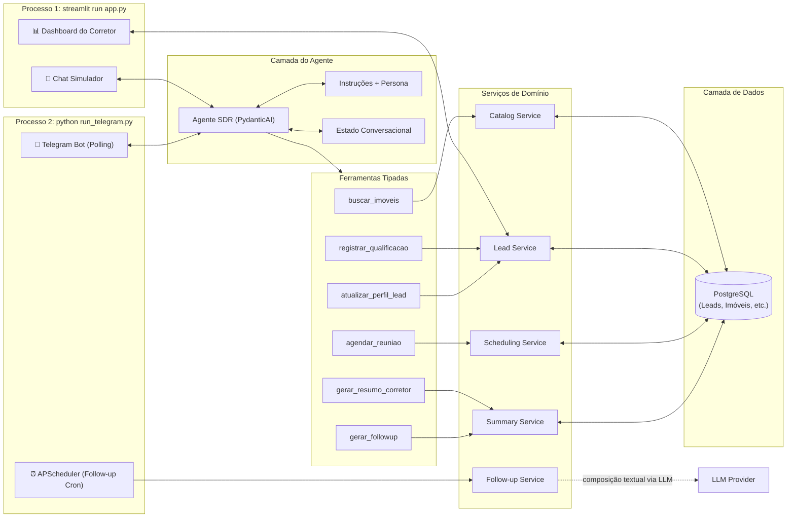

# Plano de Implementação: Agente SDR Imobiliário com IA
**Hackathon FIAP — Tech Challenge (Fase 5)**

---

## 1. O que é um SDR (Sales Development Representative)?

**SDR** significa **Sales Development Representative** (em português: **Representante de Desenvolvimento de Vendas** ou **Pré-vendedor**).

No contexto comercial e imobiliário, o SDR é o profissional ou agente responsável pela **primeira etapa do funil de vendas**:
- **Atendimento Imediato (Primeiro Contato):** Responde prontamente ao lead assim que ele demonstra interesse (via WhatsApp, chat web ou portal), eliminando o tempo de resposta elevado.
- **Qualificação Ativa:** Faz perguntas estratégicas e consultivas para entender a real intenção do cliente (compra, aluguel ou investimento), faixa de preço/ticket, localização desejada, dormitórios e urgência.
- **Follow-up Automático:** Reengaja leads que iniciaram conversa mas deixaram de responder, mantendo o relacionamento aquecido com contexto.
- **Passagem de Bastão (Handover):** O SDR **não fecha contratos**; seu papel é conduzir o cliente até o **agendamento de visita ou reunião** e entregar ao corretor especialista um dossiê/resumo estruturado com todos os dados coletados.

> **Por que automatizar com IA?** Como aponta o edital do Tech Challenge, imobiliárias sofrem com sobrecarga operacional, demora no retorno e perda de leads quentes. O Agente SDR com IA Generativa resolve esse gargalo operando 24/7 com atendimento humanizado e consistente.

---

## 2. Visão Geral da Solução

O objetivo deste projeto é construir uma **prova de conceito** funcional e escalável de uma **solução de SDR imobiliário com IA**.

A solução automatiza o primeiro atendimento de leads imobiliários, qualificando interesses, oferecendo recomendações com base em catálogo amplo de imóveis, realizando follow-ups inteligentes para leads inativos, apoiando agendamentos com corretores e gerando relatórios executivos em um dashboard.

O foco da solução não é substituir o corretor, mas **aumentar a velocidade e a qualidade da pré-venda**, garantindo que o corretor receba leads mais bem qualificados, com contexto consolidado e próximos passos sugeridos.

---

## 3. Objetivos da Prova de Conceito

### Objetivo principal
Construir um agente conversacional capaz de atuar como SDR imobiliário digital, cobrindo o ciclo inicial de atendimento, qualificação, recomendação, reengajamento e handover para o corretor.

### Objetivos específicos
- Responder leads em linguagem natural com tom consultivo e humanizado.
- Coletar dados essenciais de qualificação sem tornar a conversa robótica.
- Recomendar imóveis aderentes ao perfil do lead com base em filtros e ranking textual.
- Registrar histórico, score e status do lead em banco local.
- Agendar visita ou reunião quando houver intenção qualificada.
- Gerar resumo executivo para o corretor com preferências, objeções e próximos passos.
- Permitir visualização operacional via dashboard em Streamlit.

### Critérios de sucesso
- Demonstrar os 3 cenários obrigatórios do desafio.
- Persistir dados de leads, mensagens e agendamentos.
- Exibir recomendações coerentes com o perfil informado.
- Produzir resumo estruturado e útil para o corretor.
- Permitir simulação de follow-up contextual.

---

## 4. Requisitos do Desafio e Cobertura

| Requisito do Edital | Implementação na Solução |
| :--- | :--- |
| **Atendimento Conversacional & Humanizado** | Persona consultiva, empática e profissional com instruções de comportamento e respostas contextualizadas. |
| **Qualificação de Leads** | Extração estruturada de intenção, orçamento, quartos, localização, urgência e perfil de compra/investimento. |
| **RAG / Base de Imóveis** | Catálogo estruturado no PostgreSQL (centenas/milhares de registros) com busca SQL e Full-Text Search. |
| **Agendamento de Reuniões / Visitas** | Tool calling para registrar visita ou reunião no banco local. |
| **Follow-up Automático** | Módulo de reengajamento com base no histórico e no estágio do funil. |
| **Resumo Inteligente para Corretores** | Geração de dossiê com score, preferências, objeções, imóveis sugeridos e próximos passos. |
| **Dashboard Mínimo** | Painel com KPIs, listagem de leads, agendamentos, filtros e acionamento de follow-up. |

---

## 5. Cenários de Negócio Obrigatórios

1. **Cenário 1 — Compra Residencial**
   - *Entrada:* "Estou procurando apartamento na zona sul."
   - *Comportamento esperado:* identificar intenção de compra, coletar faixa de preço, quantidade de quartos, bairro de interesse e urgência; buscar imóveis aderentes; sugerir opções; propor agendamento.

2. **Cenário 2 — Investimento**
   - *Entrada:* "Quero investir em imóveis para renda."
   - *Comportamento esperado:* mudar para perfil investidor, identificar ticket disponível, objetivo de retorno, horizonte de investimento e preferência por liquidez/locação; sugerir oportunidades; direcionar para especialista.

3. **Cenário 3 — Follow-up Automático**
   - *Entrada:* Cliente iniciou conversa e parou de responder antes do agendamento.
   - *Comportamento esperado:* retomar contato com contexto, linguagem cordial e proposta de valor, sem parecer insistente ou genérico.

---

## 6. Stack Tecnológica Recomendada

Para evitar reinventar a roda e acelerar a implementação da prova de conceito, a solução adotará uma stack moderna, enxuta e orientada a produtividade.

### Aplicação e interface
- **Python 3.11+**
- **Streamlit** para chat simulador e dashboard do corretor na mesma aplicação
- **`streamlit-authenticator`** para login obrigatório em toda a UI (ver [`03-autenticacao-da-ui.md`](../03-operacao/03-autenticacao-da-ui.md))

### Canal de mensageria real
- **Telegram Bot API** via `python-telegram-bot` (v21+, asyncio nativo)
- Custo zero, sem burocracia de aprovação, funciona com Long Polling em localhost
- Papel complementar ao chat Streamlit: experiência mobile autêntica para demonstração

### Agente e integração com LLM
- **PydanticAI** como framework principal do agente
- **Pydantic v2** para validação, schemas e saídas estruturadas
- **Provider OpenAI-compatible configurável por `.env`** para permitir troca de modelo/provedor sem reescrever a aplicação
- **Controle de custos** com limites por conversa e globais, tracking em tabela dedicada (ver [`04-governanca-de-custos-llm.md`](../03-operacao/04-governanca-de-custos-llm.md))

### Persistência e dados
- **PostgreSQL 16** como banco de dados principal (dados e catálogo)
- **SQLAlchemy** para modelagem e acesso organizado ao banco
- **`psycopg[binary]`** como driver PostgreSQL
- **Alembic** para migrations de schema

### Infraestrutura e deploy
- **Docker Compose** para desenvolvimento local (postgres + app + telegram-bot)
- Deploy cloud-ready via **Railway**, **Render** ou VPS com Docker (ver [`01-infraestrutura-e-deploy.md`](../03-operacao/01-infraestrutura-e-deploy.md))

### Busca e recomendação
- **Filtros estruturados por metadados** (SQL nativo) como estratégia inicial
- **Full-Text Search (FTS) do PostgreSQL** para ranking textual sobre descrição e tags
- **Embeddings / busca vetorial** (`pgvector`) ficam como evolução opcional

### Automação e scheduling
- **APScheduler** para job periódico de follow-up automático de leads inativos
- Roda no mesmo processo do Telegram Bot (já é long-running com event loop asyncio)

### Observabilidade e qualidade
- **Logfire** (opcional, mas recomendado) para tracing de chamadas do agente e tools
- **pytest** para testes unitários e funcionais
- **ruff** para lint e padronização

### Justificativa da stack
- **PydanticAI** reduz parsing manual, facilita tool calling tipado e garante saídas estruturadas.
- **Streamlit** acelera a entrega visual da prova de conceito sem exigir frontend separado.
- **Telegram Bot** adiciona canal real de mensageria com zero custo e setup mínimo (~3h, ~130 LOC).
- **PostgreSQL** unifica o armazenamento do catálogo e dados conversacionais, garantindo acesso concorrente nativo e recursos de FTS.
- **Docker Compose** padroniza o ambiente e simplifica o onboarding.
- **APScheduler** automatiza follow-up sem depender de ação manual do corretor.

---

## 7. Arquitetura da Solução

A solução opera em **dois processos independentes** que compartilham a mesma camada de negócio e o mesmo banco PostgreSQL:

### Modelo de execução

| Processo | Comando | Responsabilidade |
|---|---|---|
| **Processo 1** | `streamlit run app.py` | Chat simulador (sandbox) + Dashboard do corretor |
| **Processo 2** | `python run_telegram.py` | Bot Telegram (Long Polling) + Scheduler de follow-up (APScheduler) |
| **Supervisor** | `python run_all.py` | Inicia ambos os processos e gerencia encerramento gracioso (Ctrl+C) |

### Princípios arquiteturais
- Separar **conversa**, **regras de negócio** e **persistência**.
- **Dois processos, uma camada de negócio:** ambos importam os mesmos services e o mesmo agente PydanticAI.
- **PostgreSQL** gerencia concorrência nativamente (MVCC) — sem necessidade de configuração especial para acesso multiprocesso.
- Manter o agente responsável por **decidir e orquestrar**, não por acessar banco diretamente.
- Tratar tools como contratos explícitos entre o modelo e a aplicação.
- Persistir estado relevante do lead fora da memória temporária da sessão.

---

## 8. Estratégia do Agente e Tool Calling

O agente SDR opera como pré-vendedor consultivo: qualifica progressivamente via conversa natural, mantém um `perfil_narrativo` incremental, busca imóveis quando há contexto suficiente e propõe agendamento no momento adequado.

> Detalhamento completo e estratégia de busca em camadas: [`02-estrategia-de-agente-e-tools.md`](../02-arquitetura/02-estrategia-de-agente-e-tools.md)

---

## 9. Modelagem de dados

Entidades principais: **Lead** (qualificação + `perfil_narrativo` evolutivo), **Mensagem** (histórico), **Agendamento** (visitas/reuniões), **Imóvel** (catálogo) e **LLMUsage** (tracking de consumo). O `perfil_narrativo` é um campo TEXT mantido pela LLM que acumula contexto rico do lead — o produto principal do SDR.

> Modelagem conceitual e lógica, incluindo schemas, enums, exemplo de `perfil_narrativo`, tipos SQL, constraints, índices, identidade de canal, mensagens, follow-up, score e status: [`01-modelagem-logica-do-banco.md`](../04-dados/01-modelagem-logica-do-banco.md)

> Decisão de modelagem para identidade de canal e ausência deliberada de entidade explícita de `conversation` / `session`: [`02-identidade-de-canal-e-conversa.md`](../04-dados/02-identidade-de-canal-e-conversa.md)

---

## 10. Estrutura de Diretórios e Dependências

A estrutura de pastas completa, `requirements.txt`, `Dockerfile`, `docker-compose.yml` e as variáveis de ambiente necessárias estão documentadas no documento de infraestrutura.

> Detalhamento: [01-infraestrutura-e-deploy.md](../03-operacao/01-infraestrutura-e-deploy.md)

### Documentação complementar de engenharia

Além dos sub-planos funcionais, a especificação técnica complementar da solução está organizada nos seguintes documentos:

| Documento | Finalidade |
|---|---|
| [02-qualidade-e-criterios.md](./02-qualidade-e-criterios.md) | Requisitos não funcionais, critérios de aceite, segurança mínima, observabilidade e definição de pronto |
| [03-cenarios-de-runtime.md](../02-arquitetura/03-cenarios-de-runtime.md) | Cenários de runtime arquiteturalmente relevantes |
| [04-contratos-das-tools.md](../02-arquitetura/04-contratos-das-tools.md) | Contratos funcionais das tools do agente |
| [01-estrategia-de-testes.md](../05-engenharia/01-estrategia-de-testes.md) | Estratégia de testes por camadas e regressão dos cenários obrigatórios |
| [02-matriz-de-rastreabilidade.md](../05-engenharia/02-matriz-de-rastreabilidade.md) | Rastreabilidade entre requisitos, componentes, testes e evidências |
| [adr/](../06-decisoes/adr/) | Registro das principais decisões arquiteturais (ADRs) |

---

## 11. Fases de Execução

> Os itens marcados foram verificados no código e em execução. Os
> desmarcados não estão implementados, com a razão logo abaixo quando não
> for óbvia. O `README.md` traz a mesma lista de limitações do ponto de
> vista de quem vai rodar o projeto.

### Fase 1: Fundamentos de Dados, Infraestrutura e Catálogo
- [x] Configurar Docker Compose com PostgreSQL + serviços da aplicação (ver [01-infraestrutura-e-deploy.md](../03-operacao/01-infraestrutura-e-deploy.md)).
- [x] Gerar catálogo sintético de imóveis e carregá-lo no PostgreSQL via script de seed (`scripts/seed_imoveis.py`).
- [x] Definir schemas Pydantic para `Lead`, `Mensagem`, `Agendamento`, `Imovel` e `LLMUsage`.
- [x] Implementar camada de banco com PostgreSQL + SQLAlchemy + Alembic.
- [x] Configurar autenticação do Streamlit (ver [03-autenticacao-da-ui.md](../03-operacao/03-autenticacao-da-ui.md)).
- [x] Implementar controle de custos LLM (ver [04-governanca-de-custos-llm.md](../03-operacao/04-governanca-de-custos-llm.md)).
- [x] Criar seed inicial e funções de leitura/escrita.
- [x] Implementar serviço de catálogo com filtros estruturados e ranking textual.

### Fase 2: Agente SDR e Estado Conversacional
- [x] Criar persona e instruções do agente em `src/agent/prompts.py`.
- [x] Implementar agente principal com PydanticAI em `src/agent/sdr_agent.py`.
- [ ] Definir output estruturado do agente para resposta + atualização de estado.
  > Feito de outro jeito: a resposta é texto e a atualização de estado acontece pelas tools.
- [x] Implementar tools tipadas:
  - [x] `buscar_imoveis`
  - [x] `registrar_qualificacao`
  - [x] `atualizar_perfil_lead` — atualização incremental do perfil narrativo
  - [x] `agendar_reuniao`
  - [x] `gerar_resumo_corretor`
- [x] Injetar `perfil_narrativo` atual como contexto do agente a cada turno.
- [x] Persistir histórico e estado relevante do lead.

### Fase 3: Qualificação, Score e Perfil Narrativo
- [x] Definir critérios explícitos de score do lead:
  - Completude dos dados (quantos campos estruturados preenchidos)
  - Urgência declarada (alta/média/baixa)
  - Aderência com catálogo (existem imóveis compatíveis?)
  - Engajamento conversacional (turnos, perguntas feitas pelo lead)
  - Intenção de agendamento manifestada
- [x] Implementar score baseado nos critérios acima.
- [x] Atualizar status do lead conforme avanço no funil.
- [x] Garantir que o resumo do corretor explique o score de forma simples.
- [ ] Registrar rejeições de imóveis como dado valioso no perfil narrativo.
  > O prompt instrui e o modelo costuma fazer, mas não há nada em código que garanta.

### Fase 4: Follow-up Automático com Scheduler
- [x] Implementar `src/services/followup_service.py`:
  - Consulta leads inativos por régua/etapa do funil.
  - Gera mensagem contextual via LLM com base no `perfil_narrativo` e histórico.
  - Respeita limite de tentativas (2-3 por régua).
- [x] Implementar `src/scheduler/followup_scheduler.py` com APScheduler:
  - Job periódico (a cada 30 min) que varre leads inativos automaticamente.
  - Integrado ao processo do Telegram Bot (event loop asyncio compartilhado).
- [x] Réguas diferenciadas por estágio do funil:
  - **Lead novo sem resposta** (>2h): tom amigável, pergunta se é bom horário.
  - **Qualificação interrompida** (>6h): retoma de onde parou, referencia último tópico.
  - **Pós-envio de imóveis** (>24h): pergunta se viu as opções, qual agradou mais.
  - **Pós-agendamento** (<24h antes): confirmação/lembrete de visita ou ligação.
- [x] Registrar cada follow-up no histórico do lead.
- [x] Manter botão "Disparar Follow-up" no dashboard para ação manual sob demanda (mesma lógica, gatilho diferente).
  > O botão do cartão dispensa apenas a janela de inatividade — quem está olhando o lead já decidiu que é hora. O teto de tentativas da régua e o orçamento de LLM continuam valendo. `python -m scripts.run_followup_once` roda um ciclo inteiro pela linha de comando.

### Fase 5: Canal Telegram
- [ ] Criar bot via @BotFather e configurar `TELEGRAM_BOT_TOKEN` no `.env`.
- [x] Implementar `src/channels/telegram_bot.py`:
  - Handler `/start` com saudação e criação do lead no banco.
  - Handler de mensagens de texto com despacho para o agente SDR.
  - Mapeamento `telegram_chat_id` → `lead_id` no banco.
  - Indicador "digitando..." (`ChatAction.TYPING`) enquanto a LLM processa.
- [x] Implementar `run_telegram.py` (entry point do Processo 2):
  - Inicializa o bot com Long Polling.
  - Inicializa o scheduler de follow-up no mesmo event loop.
- [x] Implementar `run_all.py` (supervisor):
  - Inicia `streamlit run app.py` e `python run_telegram.py` em paralelo.
  - Gerencia encerramento gracioso com Ctrl+C.
- [ ] Exibir QR code do bot (`https://t.me/NomeDoBot`) no dashboard Streamlit.

### Fase 6: Interface Streamlit e Dashboard do Corretor

A interface se divide por assunto, e o papel do usuário decide quais menus aparecem:

| Menu | Para quê | Quem vê |
|---|---|---|
| **Dashboard** | leitura: KPIs, distribuição da carteira, custo de LLM | todos (o painel de custo, só o admin) |
| **Leads** | operação: ficha, canal, follow-up, conversa, exclusão | todos |
| **Chat Simulador** | testar o agente como se fosse um lead | só o admin |
| **Ajuda** | o que a aplicação faz, como usar e por que ela se comporta assim | todos |

A ficha do lead é uma página própria (`/lead`), criada com `visibility="hidden"` para ficar fora do menu. Duas páginas, e não dois estados da mesma tela: é o que faz o link **Leads** devolver a listagem quando se está dentro de uma ficha, sem precisar adivinhar se o clique veio do menu ou de um botão da própria tela.

A separação é de assunto, não de permissão: o dashboard responde "como está a
carteira" e o menu de leads responde "o que eu faço com este lead". Misturar os
dois era o que fazia a tela de estatísticas carregar o histórico de conversa de
cada lead.

- [ ] Desenvolver aba de chat simulador com histórico e streaming de resposta.
  > Histórico funciona. Não há streaming: a resposta aparece inteira de uma vez.
- [x] Restringir o simulador ao papel `admin`: é ferramenta de teste, não de atendimento.
- [x] **Página de ajuda** com o estado desta instalação (chat configurado, papel do usuário, estabilidade da sessão), o que cada menu faz e um FAQ. Responde de dentro da tela o que hoje só o README responde — e o que só aparece usando, como *por que sumiu um menu* ou *por que a sessão caiu*.
- [x] **Conversa em caixa de altura fixa**, no simulador e na ficha: solta na página ela empurrava para fora da tela o seletor de conversa e as ações do lead.
- [x] **Dashboard** centrado no **goal principal: agendar ligação do corretor com o cliente**.
  - [x] **KPIs no topo** (`st.metric`): Total de leads, Leads quentes (score≥7), Agendamentos, Follow-ups enviados, Leads inativos.
  - [x] **Distribuição da carteira**: leads por status, na ordem do funil, e leads por intenção.
  - [x] **Carteira ordenável** (`st.dataframe`): a lupa de cada linha abre a ficha daquele lead. Seleção por célula, e não por linha — a coluna de caixas de marcar prometeria uma ação em lote que não existe.
  - [x] **Consumo de LLM**, só para o admin: tokens, custo, tempo médio de resposta e taxa de erro. O alerta de orçamento estourado aparece para todos — ele explica por que o chat parou de responder.
- [x] **Menu de leads** com o ciclo completo:
  - [x] **Busca livre** (`st.text_input`): filtra por nome, bairro, intenção ou conteúdo do perfil narrativo.
  - [x] **Filtros** (`st.selectbox`): Status e Intenção.
  - [x] **Lista ordenada por score**, um cartão por lead, com selos de status, temperatura (quente/morno/frio), intenção e região. O próprio nome é o link para a ficha.
  - [x] **Ficha editável**: qualificação, contato e perfil narrativo. Um campo apagado é gravado como nulo, para o corretor conseguir limpar o que o agente entendeu errado; o status que ele escolher não é recalculado por cima.
  - [x] **Criação manual de lead**, para o corretor cadastrar quem chegou por fora do agente.
  - [x] **Vínculo de canal**: liga o lead a um `channel` + identificador, que é o que torna um lead criado à mão alcançável pelo follow-up.
  - [x] **Conversa** em aba, somente leitura, dentro de caixa rolável.
  - [x] **Agendamentos** em aba, com formulário de criação e edição: tipo, data e hora em seletores próprios, imóvel opcional, observações e status.
  - [x] **Ações**: disparar follow-up e excluir lead.

### Fase 7: Observabilidade, Testes e Refino
- [x] Instrumentar logs do agente e tools.
- [x] Criar testes unitários para busca, score e follow-up.
- [x] Criar testes das tools principais.
- [x] Validar os 3 cenários obrigatórios ponta a ponta.
- [ ] Testar fluxo completo: Telegram → agente → banco → dashboard (sincronização entre processos).
  > Depende de um bot real; nunca foi executado.

> Critérios de qualidade, cenários mensuráveis e estratégia de testes: [02-qualidade-e-criterios.md](./02-qualidade-e-criterios.md) e [01-estrategia-de-testes.md](../05-engenharia/01-estrategia-de-testes.md)

### Fase 8: Documentação e Entrega
- [x] Elaborar `README.md` com visão do problema, arquitetura, stack e instruções de execução.
- [x] Documentar limitações da POC e próximos passos.
- [ ] Preparar roteiro do pitch técnico e da demonstração em vídeo.
- [ ] Preparar QR code do bot Telegram para demonstração ao vivo.

---

## 12. Riscos, Limitações e Mitigações

### Riscos principais
- Respostas inconsistentes do modelo em cenários ambíguos.
- Catálogo sintético ser gerado com descrições textuais pobres ou repetitivas, limitando a eficácia do matching textual do SDR.
- Follow-up parecer genérico ou repetitivo.
- Escopo crescer demais para o tempo do hackathon.

### Mitigações
- Usar saída estruturada e tools tipadas.
- Utilizar o PostgreSQL Full-Text Search (FTS) para ranking textual como alternativa viável e eficiente à busca em banco vetorial no MVP.
- Limitar escopo a poucos fluxos muito bem executados.
- Garantir que a etapa de geração do catálogo produza descrições ricas e variadas, e que o script de seed (`seed_imoveis.py`) apenas valide e carregue esses registros na base.

### Limitações assumidas da POC
- Sem integração real com CRM externo.
- Sem calendário externo real (Google Calendar, Outlook).
- Autenticação simples (usuário/senha local) — sem SSO, LDAP ou OAuth.
- Canal de mensageria via Telegram (não WhatsApp Business API, que é o padrão do mercado imobiliário brasileiro).

---

## 13. Próximos Passos Pós-Hackathon

- Migrar canal de mensageria do Telegram para **WhatsApp Business API** (padrão do mercado imobiliário brasileiro).
- Integrar com CRM imobiliário (Vista, Kenlo, Jetimob ou HubSpot).
- Evoluir a busca Full-Text Search (FTS) nativa para **busca vetorial com embeddings** (`pgvector`), aprimorando o cruzamento semântico de longo alcance.
- Incluir agenda real com Google Calendar ou Microsoft 365.
- Evoluir autenticação para SSO/OAuth com perfis de corretor individuais. Os papéis de hoje (`admin`, `corretor`) vivem num YAML versionado e separam telas, não protegem dados — ver [`03-autenticacao-da-ui.md`](../03-operacao/03-autenticacao-da-ui.md).
- **Amadurecer o lead criado à mão até ele ser atendível ponta a ponta.** Hoje o corretor cria a ficha e vincula um canal, e o follow-up passa a alcançar o lead. Falta fechar o ciclo: validar que o identificador existe no canal antes de aceitar (hoje um `chat_id` inventado só falha na hora do envio); tratar o caso do Telegram, em que o bot não consegue iniciar conversa com quem nunca falou com ele; e decidir se o agente deve abrir a conversa com uma mensagem de apresentação em vez de um follow-up de retomada, que pressupõe um histórico que não existe.
- Evoluir dashboard com métricas históricas e conversão por etapa.
- Implementar processamento de áudio (transcrição de mensagens de voz no Telegram/WhatsApp).

---

## 14. Referências de Mercado

O design do projeto foi informado pela análise de 3 ferramentas comerciais de SDR imobiliário com IA (Lais.ai, Maya/Plaza, Squad/Inner AI). Os padrões convergentes incorporados: qualificação progressiva, perfil narrativo rico, rejeições como dado, dossier como produto, follow-up contextual e scoring transparente.

> Detalhamento dos benchmarks: [01-benchmarks-de-mercado.md](../07-referencias/01-benchmarks-de-mercado.md)

---

## 15. Documentos Complementares

Os detalhamentos técnicos foram extraídos para manter este plano principal como um roteiro conciso. Eles estão divididos entre **documentos funcionais e arquiteturais** e **documentos complementares de engenharia**.

### 15.1 Documentos funcionais e arquiteturais

| Documento | Conteúdo |
|---|---|
| [02-estrategia-de-agente-e-tools.md](../02-arquitetura/02-estrategia-de-agente-e-tools.md) | Estratégia de agente, tools, perfil narrativo e busca em camadas |
| [01-infraestrutura-e-deploy.md](../03-operacao/01-infraestrutura-e-deploy.md) | Docker Compose, Dockerfile, PostgreSQL, dependências e deploy |
| [03-autenticacao-da-ui.md](../03-operacao/03-autenticacao-da-ui.md) | `streamlit-authenticator`, credenciais bcrypt e proteção total |
| [04-governanca-de-custos-llm.md](../03-operacao/04-governanca-de-custos-llm.md) | Tabela `llm_usage`, limites por conversa/globais e tracking |
| [01-benchmarks-de-mercado.md](../07-referencias/01-benchmarks-de-mercado.md) | Análise de mercado e padrões adotados |

### 15.2 Documentos complementares de engenharia

| Documento | Conteúdo |
|---|---|
| [02-qualidade-e-criterios.md](./02-qualidade-e-criterios.md) | Requisitos de qualidade, critérios de aceite, segurança mínima, observabilidade e definição de pronto |
| [01-modelagem-logica-do-banco.md](../04-dados/01-modelagem-logica-do-banco.md) | Modelagem lógica do banco com tipos, constraints, índices, identidade de canal, mensagens, follow-up, score e status |
| [02-identidade-de-canal-e-conversa.md](../04-dados/02-identidade-de-canal-e-conversa.md) | Decisão de modelagem para identidade de canal e estratégia de conversa/sessão na prova de conceito |
| [03-cenarios-de-runtime.md](../02-arquitetura/03-cenarios-de-runtime.md) | Fluxos de runtime críticos para implementação, testes e demo |
| [04-contratos-das-tools.md](../02-arquitetura/04-contratos-das-tools.md) | Contratos das tools do agente com entradas, saídas, regras e erros tratáveis |
| [01-estrategia-de-testes.md](../05-engenharia/01-estrategia-de-testes.md) | Estratégia de testes unitários, integração, contratos e E2E |
| [02-matriz-de-rastreabilidade.md](../05-engenharia/02-matriz-de-rastreabilidade.md) | Matriz de rastreabilidade entre requisitos, cenários, componentes e evidências |
| [adr/](../06-decisoes/adr/) | ADRs com decisões arquiteturais e trade-offs principais |

---

## 16. Conclusão

Esta prova de conceito propõe uma **solução de SDR imobiliário com IA** focada em resolver um problema real de negócio: a perda de leads por demora, falta de qualificação e ausência de follow-up consistente.

A solução foi planejada para ser:
- **simples o suficiente para hackathon**;
- **moderna o suficiente para demonstrar boas práticas de agentes com IA**;
- **estruturada o suficiente para evoluir depois da entrega**;
- **alinhada com o estado da arte do mercado** (perfil narrativo evolutivo);
- **pronta para produção**, com PostgreSQL, Docker, autenticação e controle de custos desde o início.

Ao adotar **PydanticAI + Streamlit + PostgreSQL + Docker + Telegram**, o projeto entrega uma prova de conceito funcional que pode ser publicada na internet para avaliação real. O `perfil_narrativo` — um texto rico e incremental mantido pela LLM — é o diferencial central: transforma o agente de um simples chatbot de triagem em um verdadeiro **produto de pré-venda** que entrega contexto completo e acionável ao corretor humano.
