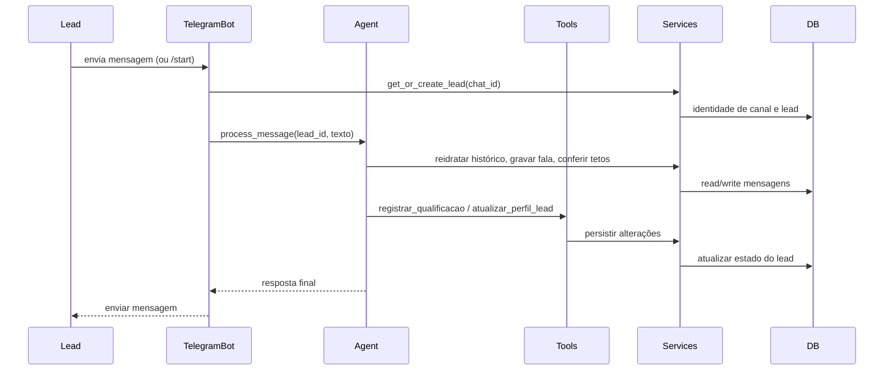
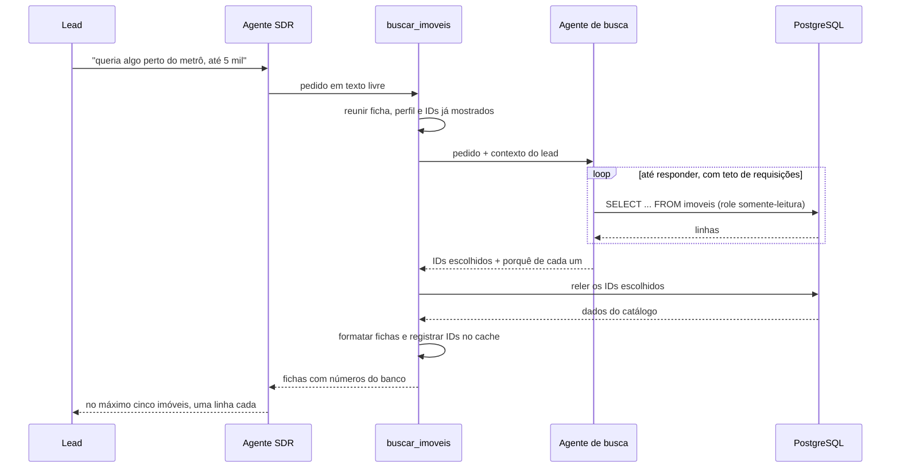
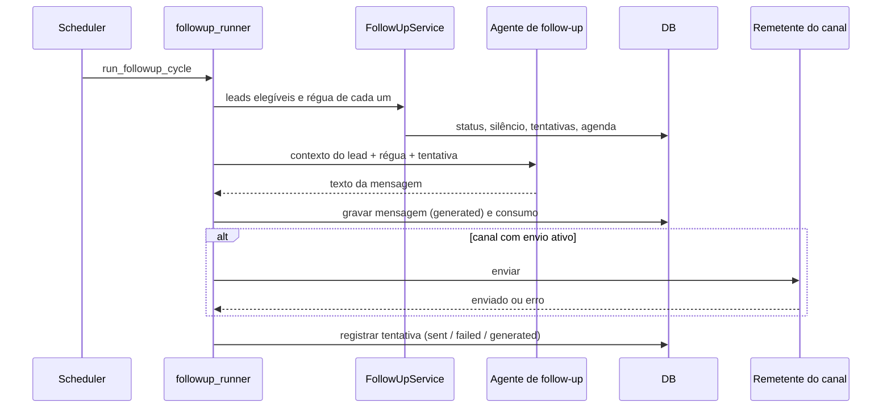

# Cenários de Runtime

**Objetivo:** documentar os principais fluxos de execução da solução para alinhar implementação, testes, observabilidade e demonstração.

---

## 1. Objetivo

Documentar os principais fluxos de runtime da POC para alinhar:
- implementação;
- testes;
- observabilidade;
- entendimento entre produto, engenharia e banca avaliadora.

A proposta é manter poucos cenários, mas representativos.

---

## 2. Cenário R1 — Atendimento inicial via Telegram

### Descrição
Lead inicia conversa pelo Telegram e recebe primeira resposta do agente SDR.

### Fluxo
1. Usuário envia mensagem ao bot — ou `/start`, que abre a conversa.
2. `telegram_bot.py` resolve o lead pelo `chat_id` com `LeadService.get_or_create_lead`: acha o lead dono dessa identidade de canal ou cria um novo. O nome do perfil do Telegram vai em toda mensagem, e não só no `/start` — que o Telegram só manda na primeira vez que o chat é aberto: ele preenche o nome de um lead que ainda não tem nenhum, sem sobrescrever o que a pessoa disse na conversa.
3. O adaptador entrega o texto e o `lead_id` a `process_message`. O `/start` não tem texto do usuário, então vai uma saudação sintética, para a primeira resposta sair do agente e não de uma mensagem fixa.
4. `process_message` reidrata o histórico do banco, grava a fala recebida, devolve ao funil um lead `novo` ou `inativo` e confere os tetos de custo — diário e mensal bloqueiam o turno; o da conversa faz handover ao corretor. As instruções do turno trazem o que se sabe do lead, o `perfil_narrativo` e o compromisso de pé.
5. O agente processa a mensagem e, se necessário, chama tools de qualificação, atualização de perfil, busca e agendamento.
6. Os efeitos persistentes acontecem nas tools, que delegam aos services.
7. A resposta é gravada e `telegram_bot.py` a envia ao usuário. Falha do provider vira, dentro de `process_message`, a mensagem de atendimento indisponível (cenário R5); qualquer outra exceção que chegue ao adaptador vira um pedido de desculpas, e o erro vai para o log.

### Notas arquiteturais
- O canal Telegram não contém regra de negócio: resolve a identidade pelo service e delega o resto.
- O agente não acessa banco diretamente; usa tools/services.
- Toda interação relevante deve ser rastreável por `lead_id`.

---

## 3. Cenário R2 — Busca e recomendação de imóveis

### Descrição
O agente conversacional descreve o que a pessoa procura e um agente de busca
dedicado investiga o catálogo para responder.

### Pré-condições
- qualquer indicação do que a pessoa procura. A busca é instrumento de
  qualificação, não consequência dela: ela acontece cedo e com pouca informação.

### Fluxo
1. O agente conversacional escreve o pedido em texto livre e chama `buscar_imoveis`.
2. A tool reúne o contexto: ficha estruturada do lead, perfil narrativo e IDs já apresentados nesta conversa.
3. O agente de busca consulta o catálogo por SQL, contra a role somente-leitura.
4. Ele reformula e consulta de novo até ter o que responder, ou até o teto de requisições.
5. Devolve os IDs escolhidos e uma justificativa para cada.
6. A camada de código relê os imóveis por ID, monta as fichas com os números do banco e intercala as justificativas.
7. Os IDs entram no cache da conversa; o consumo é registrado com `operation="busca"`.
8. O agente conversacional apresenta no máximo cinco deles à pessoa.

### Regras importantes
- operação, tipo e finalidade não são trocados por outra coisa;
- ausência de resultado não é erro técnico: o retorno traz os números do catálogo;
- os números apresentados vêm do banco, nunca do texto gerado pelo agente de busca;
- as consultas intermediárias não entram no histórico da conversa, só em observabilidade;
- com o provider fora do ar, a tool consulta o catálogo sem LLM, a partir da ficha estruturada;
- rejeições do lead devem alimentar o `perfil_narrativo`.

---

## 4. Cenário R3 — Follow-up automático

### Descrição
Scheduler identifica lead calado e gera um follow-up contextual.

### Fluxo
1. O APScheduler, dentro do processo do Telegram, dispara o ciclo a cada
   `FOLLOWUP_INTERVAL_MINUTES` (padrão 30).
2. `run_followup_cycle` confere os tetos diário e mensal de LLM; estourados,
   o ciclo nem começa.
3. `FollowUpService.get_eligible_leads` devolve os leads elegíveis e a régua de
   cada um: status alvo da régua, silêncio mínimo (ou visita nas próximas 24 h,
   no pós-agendamento), última mensagem que não seja do lead, e tentativas
   abaixo do teto. Um lead recebe no máximo uma régua por ciclo.
4. Para cada lead, o runner monta o contexto — dados estruturados, perfil
   narrativo, última mensagem e, no pós-agendamento, o compromisso.
5. O agente de follow-up gera o texto. Ele não tem tools: só compõe a
   mensagem, com instruções que ficam mais curtas a cada tentativa.
6. A mensagem é gravada (`message_type='followup'`, status `generated`) e o
   consumo de LLM registrado.
7. Só se tenta enviar por canal com envio ativo (`CANAIS_COM_ENVIO`, hoje o
   Telegram). No Streamlit, a mensagem gravada já é o desfecho: aparece no
   chat do lead.
8. A tentativa é registrada: `sent` quando saiu, `failed` quando se tentou
   enviar e deu errado, `generated` quando não havia para onde enviar.
9. Esgotada uma régua de silêncio, o lead vai para `inativo`.

### Variações do mesmo caminho
- **Disparo manual** — o botão da lista e da ficha chama
  `run_followup_para_lead`: mesma geração e mesmo registro, dispensando só a
  janela de silêncio. Teto de tentativas e budget continuam valendo. Como o
  Streamlit não tem remetente, a mensagem fica `generated`, e a tela mostra o
  texto gerado, a régua e a tentativa.
- **Despacho pendente** — a cada 10 s, o processo do Telegram envia o que
  ficou `generated` num canal com envio. Só sai o que tem até 15 minutos, cujo
  lead não respondeu depois, e só o mais recente de cada lead; o resto vira
  `skipped`, com o motivo. A tentativa é reservada como `sent` antes de ir à
  rede, para duas execuções nunca enviarem a mesma mensagem.
- **Ciclo avulso** — `python -m scripts.run_followup_once` roda um ciclo
  sem esperar o intervalo.

### Regras importantes
- respeitar o estágio do funil e o silêncio mínimo da régua;
- não insistir além do limite de tentativas;
- o controle da régua pertence ao `FollowUpService` e ao runner, não à LLM;
- a LLM é usada apenas para composição textual, e só cita o que o lead já
  informou: ela não busca imóveis.

---

## 5. Cenário R4 — Agendamento de reunião ou visita

### Descrição
Lead demonstra interesse suficiente e o agente propõe agendamento.

### Fluxo
1. A pessoa confirma interesse e disponibilidade.
2. O agente chama `agendar_reuniao` com tipo, data e hora e — numa visita —
   a observação com os imóveis que ela quer ver e o ID de cada um.
3. Visita sem observação é recusada com `ModelRetry`, que diz ao modelo o que
   escrever; ele chama de novo.
4. `SchedulingService.create` valida e grava. É **um compromisso ativo por
   lead**, garantido por índice único parcial no banco. Se já houver outro, a
   tool não marca nada e devolve o compromisso existente; o agente pergunta se
   a pessoa quer trocar e, com o sim dela, chama de novo com `remarcar=true`,
   que cancela o antigo e marca o novo.
5. O status do lead vai para `agendado` e o score é recalculado — visita
   marcada garante piso de 7,0.
6. Se ainda faltar nome ou telefone, o retorno da tool lembra o agente de
   pedir na mesma mensagem: um corretor vai ligar.
7. A ficha do lead, o resumo do corretor e o dashboard passam a mostrar o
   compromisso.

### Regras importantes
- agendar só com interesse e disponibilidade confirmados;
- a observação é o que o corretor lê: o compromisso não guarda imóvel em
  campo próprio;
- confirmar e cancelar agem sobre o compromisso de pé do lead, sem receber
  qual — é um só.

---

## 6. Cenário R5 — Falha do provider LLM

### Descrição
O provider configurado falha durante geração de resposta.

### Fluxo esperado
1. O canal ou serviço solicitante delega o processamento à camada do agente.
2. A aplicação tenta invocar o modelo.
3. O provider retorna erro, timeout ou indisponibilidade.
4. O erro é capturado e logado com contexto técnico.
5. A camada chamadora recebe uma resposta de falha tratada.
6. O usuário recebe mensagem amigável.
7. O processo continua saudável.

### Resultado esperado
- sem crash do processo;
- sem perda silenciosa da interação;
- com rastreabilidade do erro.

---

## 7. Cenário R6 — Lead muda de intenção no meio da conversa

### Descrição
Lead começa como compra residencial e depois revela perfil investidor.

### Fluxo esperado
1. Agente detecta mudança de intenção.
2. Chama tools para atualizar a qualificação estruturada.
3. Chama `atualizar_perfil_lead` relatando a mudança de intenção; o consolidador registra o antes e o depois no perfil, sem apagar o que já havia.
4. Ajusta estratégia de perguntas e recomendação.
5. Score e resumo futuro passam a refletir o novo contexto.

### Resultado esperado
- sistema não fica preso à primeira classificação;
- histórico preserva a evolução do entendimento.

---

## 8. Uso deste documento

Este documento deve ser usado como referência para:
- testes de integração;
- roteiros de demo;
- instrumentação de logs;
- revisão de arquitetura.

Todos os cenários acima devem ser interpretados em conformidade com o princípio arquitetural central do projeto: **canais de entrada/saída não concentram regra de negócio nem acessam o banco diretamente; a orquestração pertence ao agente e os efeitos persistentes pertencem às tools/services**.
