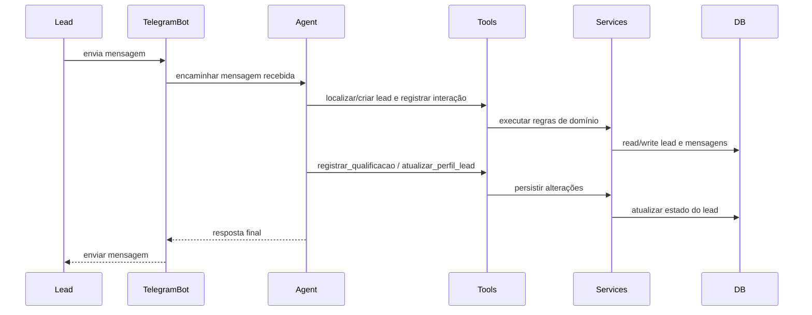
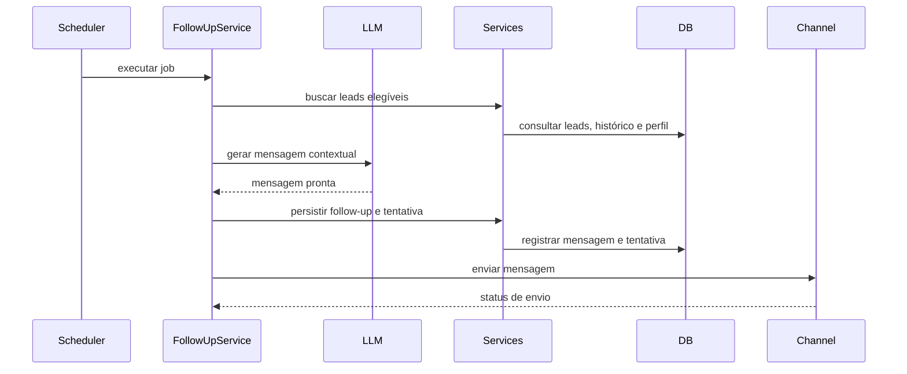

# Runtime Scenarios

**Complementa o plano principal com cenários de execução arquiteturalmente relevantes.**

---

## 1. Objetivo

Documentar os principais fluxos de runtime da POC para alinhar:
- implementação;
- testes;
- observabilidade;
- entendimento entre produto, engenharia e banca avaliadora.

A proposta é manter poucos cenários, mas representativos.

---

## 2. Cenário R1 — Atendimento inicial via Telegram

### Descrição
Lead inicia conversa pelo Telegram e recebe primeira resposta do agente SDR.

### Fluxo
1. Usuário envia mensagem ao bot.
2. `telegram_bot.py` atua como adaptador de canal e encaminha a mensagem para a camada do agente.
3. O agente identifica a necessidade de localizar ou criar o lead por meio das tools/services apropriadas.
4. O histórico relevante e o `perfil_narrativo` atual são recuperados pela camada de domínio.
5. O agente processa a mensagem com base no contexto disponível.
6. Se necessário, o agente chama tools de qualificação, atualização de perfil e registro de estado.
7. A resposta final e os efeitos de persistência são realizados pela camada de tools/services.
8. `telegram_bot.py` envia a resposta final ao usuário.

### Notas arquiteturais
- O canal Telegram não contém regra de negócio.
- O canal Telegram não acessa o banco diretamente; ele delega o processamento à camada do agente.
- O agente não acessa banco diretamente; usa tools/services.
- Toda interação relevante deve ser rastreável por `lead_id`.

---

## 3. Cenário R2 — Busca e recomendação de imóveis

### Descrição
Após obter contexto mínimo, o agente busca imóveis aderentes e recomenda opções.

### Pré-condições
- intenção conhecida;
- ao menos parte dos filtros principais disponível (ex.: orçamento, região, quartos).

### Fluxo
1. Agente identifica contexto suficiente para busca.
2. Chama `buscar_imoveis`.
3. A tool delega a consulta ao `CatalogService`.
4. `CatalogService` aplica filtros estruturados.
5. Os resultados restantes são ranqueados por FTS.
6. A tool retorna imóveis aderentes ou ausência de aderência.
7. O agente responde com recomendações ou conduz refinamento.

### Regras importantes
- filtros estruturados vêm antes do ranking textual;
- ausência de resultado não é erro técnico;
- rejeições do lead devem alimentar o `perfil_narrativo`.

---

## 4. Cenário R3 — Follow-up automático

### Descrição
Scheduler identifica lead inativo e dispara follow-up contextual.

### Fluxo
1. APScheduler dispara job periódico.
2. `FollowUpService` consulta leads elegíveis.
3. Para cada lead elegível, carrega histórico, status e `perfil_narrativo`.
4. Sistema verifica limite de tentativas e janela da régua.
5. `FollowUpService` monta o contexto necessário para a composição da mensagem.
6. `FollowUpService` aciona uma chamada de LLM focada apenas em gerar a mensagem contextual de follow-up.
7. A LLM retorna a mensagem pronta, sem executar tools nem controlar o fluxo operacional.
8. `FollowUpService` persiste a mensagem e registra a tentativa pela camada de domínio.
9. Se o canal permitir envio automático, a mensagem é enviada.
10. O status do envio é registrado.

### Regras importantes
- evitar duplicidade por janela;
- respeitar estágio do funil;
- não insistir além do limite configurado.
- o controle da régua pertence ao `FollowUpService`, não à LLM;
- a LLM é usada apenas para composição textual contextual.

---

## 5. Cenário R4 — Agendamento de reunião ou visita

### Descrição
Lead demonstra interesse suficiente e o agente propõe agendamento.

### Fluxo
1. Agente detecta intenção de avançar.
2. Chama `agendar_reuniao` com dados mínimos.
3. A tool delega a operação ao `SchedulingService`.
4. `SchedulingService` valida o payload.
5. O agendamento é persistido pela camada de domínio.
6. O resumo do corretor pode ser atualizado por tool/service apropriado.
7. O dashboard passa a exibir o compromisso.

### Regras importantes
- agendamento não deve ocorrer sem contexto mínimo;
- data/hora e tipo devem ser persistidos;
- observações devem ser registradas quando existirem.

---

## 6. Cenário R5 — Falha do provider LLM

### Descrição
O provider configurado falha durante geração de resposta.

### Fluxo esperado
1. O canal ou serviço solicitante delega o processamento à camada do agente.
2. A aplicação tenta invocar o modelo.
3. O provider retorna erro, timeout ou indisponibilidade.
4. O erro é capturado e logado com contexto técnico.
5. A camada chamadora recebe uma resposta de falha tratada.
6. O usuário recebe mensagem amigável.
7. O processo continua saudável.

### Resultado esperado
- sem crash do processo;
- sem perda silenciosa da interação;
- com rastreabilidade do erro.

---

## 7. Cenário R6 — Lead muda de intenção no meio da conversa

### Descrição
Lead começa como compra residencial e depois revela perfil investidor.

### Fluxo esperado
1. Agente detecta mudança de intenção.
2. Chama tools para atualizar a qualificação estruturada.
3. Chama `atualizar_perfil_lead` com a nova leitura do contexto.
4. Ajusta estratégia de perguntas e recomendação.
5. Score e resumo futuro passam a refletir o novo contexto.

### Resultado esperado
- sistema não fica preso à primeira classificação;
- histórico preserva a evolução do entendimento.

---

## 8. Uso deste documento

Este documento deve ser usado como referência para:
- testes de integração;
- roteiros de demo;
- instrumentação de logs;
- revisão de arquitetura.

Todos os cenários acima devem ser interpretados em conformidade com o princípio arquitetural central do projeto: **canais de entrada/saída não concentram regra de negócio nem acessam o banco diretamente; a orquestração pertence ao agente e os efeitos persistentes pertencem às tools/services**.
